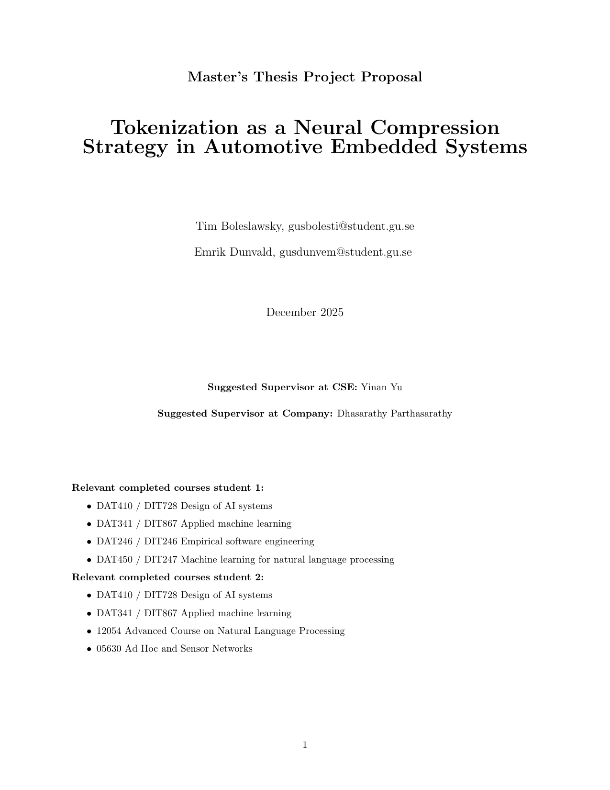

Download the full PDF: [Proposal PDF](build/proposal.pdf)

Note: `build/proposal.pdf` and `build/proposal.png` are autogenerated by CI on pushes to `main`.

Build locally:

```bash
latexmk -pdf -interaction=nonstopmode proposal.tex
``` 
